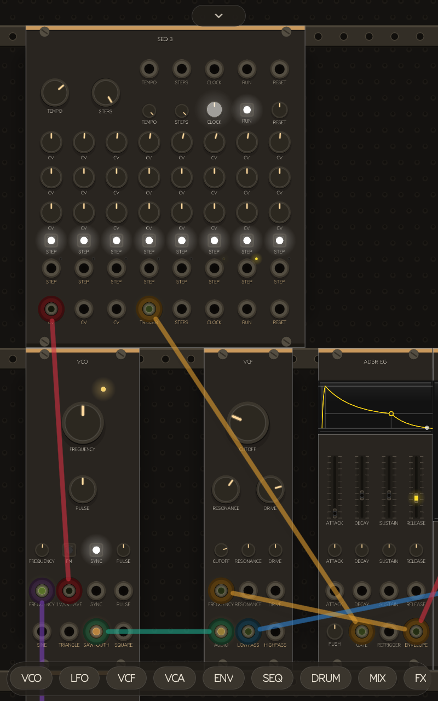
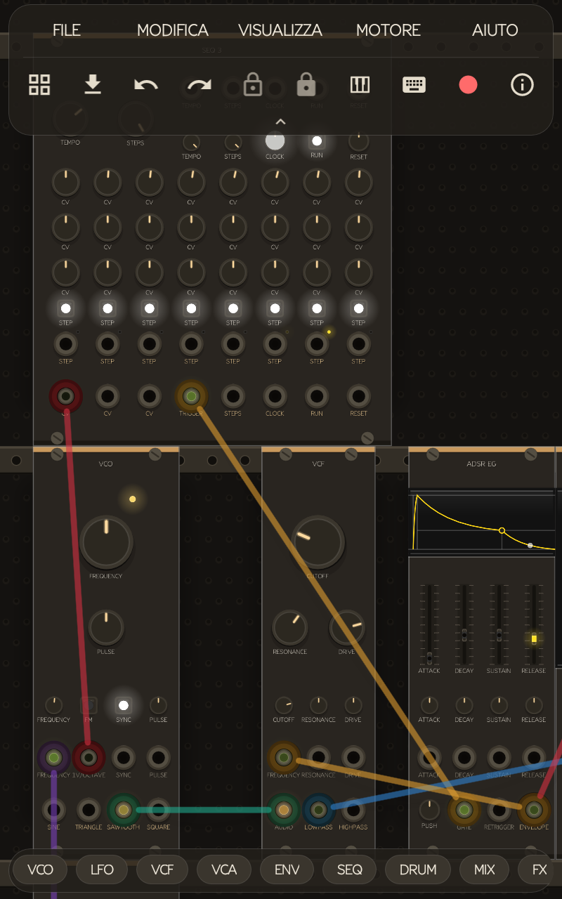

Versione inglese: [`README.md`](https://github.com/nowheel/RackDroid/blob/main/README.md)

<div align="center">

# 🎛️ RackDroid

### Il tuo rack modulare, in tasca.

Sintetizzatore modulare **touch-first** per Android — costruisci patch vere
trascinando cavi tra oscillatori, filtri, inviluppi e sequencer, esattamente
come su un rack hardware. Nessun compromesso: è il motore audio di
[VCV Rack 2](https://vcvrack.com), reso nativo per il telefono.




*Uno screenshot reale, da un dispositivo vero — nessun mockup.*

</div>

> **Versione 0.1.1** · 🌐 [rackdroid.org](https://rackdroid.org) · repo: [`nowheel/RackDroid`](https://github.com/nowheel/RackDroid) · non ufficiale, non affiliato a VCV

---

## Perché RackDroid

- **È VCV Rack, non un clone.** Stesso motore DSP, stessi 66 moduli di base,
  stesso formato patch `.vcv` — sui sorgenti upstream v2.6.4, non modificati.
- **Pensato per il tocco fin dall'inizio**, non una UI desktop rimpicciolita:
  cavi che si trascinano col dito, manopole che si tengono premute per
  digitare un valore, pizzico per lo zoom, palette moduli pensata per schermi
  piccoli, e una **barra di parcheggio cavi** che risolve il problema dei "due
  moduli che non stanno mai insieme sullo schermo".
- **Latenza nativa bassa** (Oboe/AAudio, full-duplex) — suona in tempo reale,
  non un giocattolo.
- **Cresce con te**: parti con i 66 moduli inclusi, poi aggiungi pacchetti
  interi (Bogaudio, Valley, Befaco, HetrickCV…) al volo, senza aggiornare
  l'app.
- **Gira anche su hardware datato**: supporto da Android 10 in su.

## Cosa include

| | |
|---|---|
| 🎚️ **Motore audio nativo** | Oboe/AAudio, full-duplex, bassa latenza |
| 🧩 **66 moduli di base** | Core (Audio/MIDI), Fundamental (39 moduli: VCO, VCF, VCA, ADSR, LFO, SEQ-3, Delay, Mixer, Scope, Quantizer…), RackDroid Drums (14 voci originali stile 808) |
| 👆 **Interfaccia touch** | trascini per cavi/moduli, pizzichi per zoom, tieni premuta una manopola per digitare un valore |
| 🪟 **Barra strumenti a vetro** | menu File/Modifica/Visualizza/Motore/Aiuto + palette moduli, gestore plugin, annulla/ripeti, blocco layout, MIDI, tastiera, registrazione — si richiude in una linguetta |
| 🧲 **Palette dei moduli** | chip per categoria (VCO, LFO, VCF, VCA, ENV, SEQ, DRUM, MIX, FX, NOISE, QNT, MIDI, UTIL), anteprime trascinabili, badge ⓘ con nome/descrizione/tag |
| 🧵 **Parcheggio cavi** | una barra sul bordo sinistro dove un capo del cavo aspetta mentre scorri fino alla destinazione — cresce da 3 fino a 10 buchi man mano che li riempi, illumina le porte compatibili mentre miri, si richiude in una maniglia |
| 🎹 **MIDI** | tastiera musicale a schermo, MIDI USB e Bluetooth LE |
| ⏺️ **Registrazione** | uscita su file WAV in `Documents/RackDroid/` |
| 🎓 **30 tutorial** | guidati passo-passo su 5 livelli, più una guida per argomenti |

## Moduli aggiuntivi (.rdmod)

Oltre ai moduli di base, puoi aggiungere pacchetti (Bogaudio, Valley, Audible,
Impromptu, Befaco, HetrickCV…) **al volo**, senza aggiornare l'app:

- **Dall'app**: tool *Gestore moduli* → *Installa da file* → scegli uno o più
  file `.rdmod`. Vengono caricati subito; li disinstalli dallo stesso gestore.
- **Da cartella**: copia i `.rdmod` in `Android/data/org.rackdroid/files/Modules/`
  e riavvia.

Formato del pacchetto, meccanismo di caricamento nativo e istruzioni per
**creare** un plugin: vedi **[MODULES.md](MODULES.md)** e il manuale in
**[docs/rackdroid-manuale.pdf](docs/rackdroid-manuale.pdf)**.

## Requisiti

**Android 10 (API 29) o successivo**, architettura `arm64-v8a`. Serve
OpenGL ES 3.0 (praticamente ogni telefono/tablet dal 2018 in poi).

## Build

Progetto Gradle alla radice del repo (arm64-v8a, `minSdk 29`). I sorgenti
`third_party/` (Rack v2.6.4, Oboe, tutti i plugin) sono **vendorizzati nel
repo**: un clone pulito compila così com'è, senza init di submodule.

```sh
export JAVA_HOME=~/jdk21; export ANDROID_HOME=~/android-sdk
gradle assembleRelease -PdevKeystore    # gradle 8.7+, oppure apri in Android Studio
```

- `-PdevKeystore` firma con la chiave di sviluppo pubblica (continuità di
  aggiornamento per il sideload; per Play usare una chiave privata).
- L'APK di base pesa ~40 MB: contiene solo i moduli base; CMake compila comunque
  tutti i plugin, ma i `.so` non-base sono esclusi dall'APK e distribuiti come
  `.rdmod` (`packaging.jniLibs.excludes`, vedi `scripts/make_rdmods.sh`).

## Struttura

```
app/            modulo Android (Gradle, manifest, MainActivity + UI Kotlin)
native/
  CMakeLists.txt  build motore Rack + dipendenze + port layer
  port/           codice del porting (audio Oboe, menu, browser, plugin loader…)
  host/           smoke test del motore/UI su Linux
drums/          RackDroid Drums (pacchetto first-party, codice + pannelli originali)
graphics/       grafica originale (pannelli, thumbnail, ComponentLibrary rifatta, screenshot)
third_party/    Rack, Oboe e sorgenti dei plugin (upstream intatti)
scripts/        setup.sh (sorgenti) · make_rdmods.sh (impacchetta i .rdmod)
docs/           manuale utente (PDF + sorgente HTML)
MODULES.md      formato .rdmod, caricamento e creazione dei plugin
```

Principio guida: **zero patch ai sorgenti di Rack**. Tutto il codice
piattaforma-specifico vive in `native/port/`; i file desktop-only sono esclusi
dal build e rimpiazzati, così l'aggiornamento a nuove versioni upstream resta un
bump del submodule.

## Licenze, trademark e pubblicazione — importante

- Il codice di Rack è **GPLv3**: questo port è GPLv3 e i sorgenti completi sono
  nel repository (obbligo di licenza soddisfatto ✓).
- **Trademark**: l'app si presenta come "RackDroid" (icona propria, stringhe
  rebrandizzate); il nome/logo "VCV" non è usato ✓.
- **Grafica**: la ComponentLibrary e i pannelli Core originali sono
  **CC BY-NC-ND 4.0** (non commerciale). RackDroid usa grafica **rifatta**
  (`graphics/`, GPLv3) al loro posto per essere distribuibile; i plugin
  Fundamental/Bogaudio ecc. sono GPLv3 con grafica inclusa ✓.
- **Firma**: `keystore/rackdroid.keystore` è una chiave di **sviluppo** con
  password pubblica (`rackdroid`) — continuità di aggiornamento per il sideload,
  NON autenticità. Per uno store generare una chiave privata (o Play App
  Signing).
- **Google Play**: distribuire codice nativo eseguito da **fuori** Play viola le
  policy; la cartella `.rdmod` / l'installazione da file sono per la build
  sideload/GitHub. Per Play, consegnare i pacchetti extra via *asset packs*.

---

<div align="center">

RackDroid è un port di VCV Rack (GPLv3). Non affiliato né approvato da VCV.

</div>
